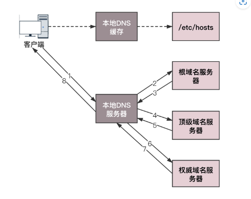
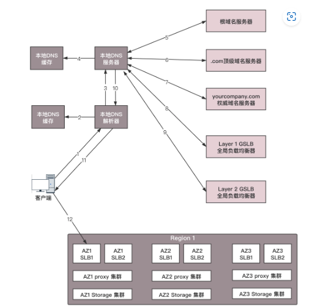
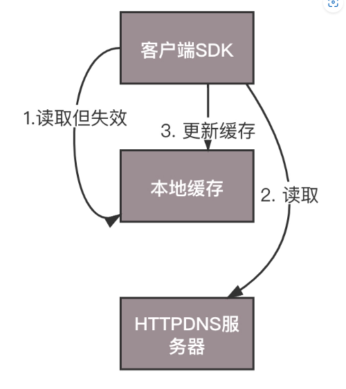
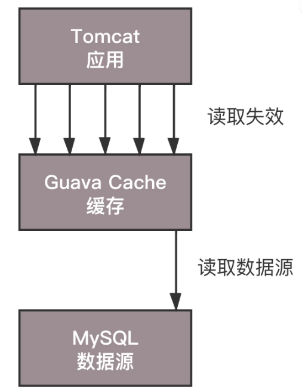
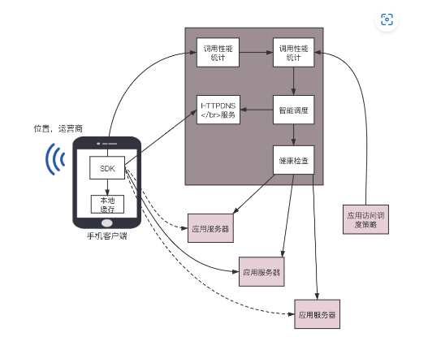

# DNS与HttpDNS

需要的性能：高可用 高并发 分布式

## DNS域名解析过程



## DNS负载均衡

### 内部负载均衡

一个域名对应多个IP，一方面一台机器如果坏了，改用另一台机器，访问该机器的应用若是配置成域名，则不需要修改配置，只需要修改域名与IP的映射；另一方面，如果另一台撑不住时，可以部署多台，修改配置策略，返回第一个，第二个，第n个

### 全局负载均衡

不需要做全局负载均衡的直接1-7即可，权威域名可以解析成一个或多个IP地址，客户端简单轮询，简单的负载均衡



全局负载均衡的话，对于权威域名服务器，通过```CNAME```的方式，给```object.yourcompany.com```起另一个别名，如```object.vip.yourcompany.com```，让本地服务器去请求GSLB（全局负载均衡器，Global ServerLoad Balance）解析这个域名，而GSLB在解析的时候就可以实现负载均衡

图中为两层负载均衡，分运营商与地域

1. 第一层查看请求的本地DNS服务器所在运营商，再通过```CNAME```的方法。让服务器请求第二层
2. 。。。。。。。。。。。。。。。。。地址，然后将距离用户最近的Region里面六个内部负载均衡（SLB ，Server Load Balancer）的地址（IP地址），返回给本地DNS服务器

但是全局负载均衡可能会失效，因为看不到用户真实的ip，只是dns访问，所以不一定是最优的路径，而且这个返回结果可能是一个用户或者上万个，可以通过流量监测来缓解

## 存在的问题

### 域名缓存问题

缓存失效，比如对应的IP地址已经换成另一个了，但是本地缓存没变

本地缓存使全局负载均衡失效，因为本地缓存存的是上次离客户最近的，但是客户地址变了之后就不一定是最近的了

缓存过期，静态页面会缓存到本运营商的服务器内，域名解析不会返回真正的网站而是该服务器地址，此时若界面有更新就无法获得

### 域名转发

比如域名的运营商转发错误

### 出口NAT的问题

NAT 网络地址转换，但是权威服务器就无法通过转化后的地址判断来自哪个运营商

### 域名更新问题

本地DNS服务器有不同地区的，不同运营商独立部署的，权威DNS服务器解析结果在全网生效周期漫长，更新不一定及时

### 解析延迟

经过很多DNS服务器才获得解析结果，带来时延，甚至解析超时

## HttpDNS

基本含义：基于自己搭建的基于HTTP协议的DNS服务器集群，分布在多个地点多个运营商，客户需要DNS解析时，直接通过HTTP协议请求，得到最近的地址

不同之处：绕过默认的解析DNS的路径（所以往往是手机应用，需要在手机端嵌入支持httpDNS的客户端SDK），客户端SDK请求服务端，获取然后缓存，

+ 缓存如何更新，何时更新由手机客户端来做，
+ 请求时，客户端也了解手机运营商与地址，所以更好地全局负载均衡
+ 解析过程，不需要本地DN服务器递归的调用，而是一个http请求就可以

### 缓存设计

设计模式分为客户端，缓存，数据源三层，对于httpDNS就是手机客户端，DNS缓存，httpDNS服务器

#### 同步解析

即```Cache-Aside```机制，先读缓存，不中即读数据库，将结果写入缓存

优缺点：实时性好，如果有多个请求发现过期，同时会请求HttpDNS多次



#### 异步解析

使用```Refresh-Ahead```机制，即业务仅仅访问缓存，当过期的时候定期刷新。在Guava Cache中有个RefreshAfterWrite机制，对于并发情况，多个缓存访问不命中从而引发并发回源的情况，可以采取一个请求回源的模式。在应用架构的缓存中，采用**数据预热**或者**预加载**的机制

优缺点：多个请求发现过期可以合并成一个，同时可以在即将过期时进行预加载，防止过期后才刷新；缺点是拿到过期数据且客户端允许就会冒一次险，拿取过期数据



### 调度设计

#### 客户端

知道手机的地理位置与运营商，加上考虑错误率，请求时间，服务器压力，网络状况等进行选择，后者通过客户端使用HttpDNS返回的IP访问业务应用，SDK收集网络请求质量数据，发送到统计后台然后分析，查看不同IP的服务质量

#### 服务端

配置不同服务质量的优先级与权重，排序出优质且时延低的IP

服务端智能调度后的返回结果，缓存在客户端，客户端根据不同运营商的SSID来分维度缓存，不同运营商与WIFI解析的结果不一样

