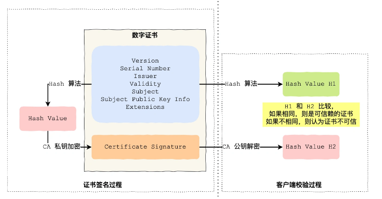

# Http

## 常见面试题

### 常见状态码

| 状态码                     | 表达的信息                                                 |
| -------------------------- | ---------------------------------------------------------- |
| 100                        | 提示信息，协议处理的中间状态                               |
| 200                        | 成功状态码                                                 |
| 204[No Content]            | 成功，但是响应头没有body                                   |
| 206[Partial Content]       | 一般用在分块下载，断点续传中，代表内容只是一部分           |
| 301[Move Permanently]      | 3xx代表重定向，资源已经不在，需要用另一个url，会自动重定向 |
| 302[Found]                 | 资源暂时不在，会自动重定向                                 |
| 304[Not Modified]          | 重定向已存在且没有修改的缓存文件                           |
| 400[Bad Request]           | 客户端请求报文有错 笼统                                    |
| 403[Forbidden]             | 服务器禁止访问该资源                                       |
| 404[Not Found]             | 资源在服务器上没找到                                       |
| 500[Internal Server Error] | 服务器错误 笼统                                            |
| 501[Not Implemented]       | 请求的功能还没有实现                                       |
| 502[Bad Gateway]           | 一般是服务器作为网关或者代理时返回                         |
| 503[Service Unavailable]   | 服务器正忙，暂时无法响应                                   |
| 504[Gateway timeout]       | 网关超时                                                   |

### 常见字段

| 客户端                                   | 服务器端                            |
| ---------------------------------------- | ----------------------------------- |
| ```Host```：服务器的域名                 | ```Content-Length```:返回数据的长度 |
| ```Connection```:表示连接状态            | ```Connection```:如长连接           |
| ```Accept```:\*/\* 接受的数据格式        | ```Content-Type```:如text/html;     |
| ```Accept-Encoding```:接受的数据压缩格式 | ```Content-Encoding```:如gzip       |

### Get与Post的区别

| Get                                                          | Post                                   |
| ------------------------------------------------------------ | -------------------------------------- |
| 获取资源                                                     | 根据报文body对资源进行处理             |
| 参数在URL上，只支持ASCII字符，浏览器对其长度有限制（并不是http） | 参数在body，数据格式无限制，无长度限制 |
| 安全性，不会破环服务器的资源                                 | 不安全                                 |
| 幂等性，多次请求，结果相同                                   | 没有幂等性                             |

**注：Get也可以携带body，任何请求都可以携带body。put请求的URL也可以携带参数**

### 缓存技术

#### 强制缓存

只要浏览器判断没有过期就可以直接使用本地缓存

**基本流程**：浏览器第一个请求时，响应同步会加上```Cache-Control```或者```Expires```(前者的优先级更高)，设置相对过期时间，当浏览器再次请求时，先看是否过期在决定是否使用缓存，

#### 协商缓存

通过服务器端

### HTTP（1.1）的特性

#### 优点：

+ 简单，报文格式为```header+body```
+ 灵活易于扩展， HTTP处于应用层，下层可以随意改变，如https在http与tcp层加了STL，http3/将TCP改成**QUIC**
+ 应用广泛，跨平台，从浏览器到手机都可以

#### 缺点:

+ 无状态，虽然不需要记录减少服务器负担，但是比如每次都要登录认证，解决方案：Cookie(第一次响应带上Cookie，第二次请求带上Cookie，类似用户身份信息)
+ 明文传输，虽然方便阅读以及抓包，但是信息暴露
+ 不安全，明文内容被盗取，不认证通信方身份会遭遇伪装，不认证报文的完整性会被篡改

#### 队头阻塞

见上文

### Http与Https的区别

1. Http明文传输，Https加密传输，加入了SSL/TLS层
2. Http连接三次握手，Https还要SSL/TLS的握手，才可以加密报文传输
3. Http的端口是80，Https的端口是443
4. Https协议需要向CA申请数字证书

注：Https加密，防篡改，身份认证

### Https的三个特点具体实现

#### 信息加密------混合加密

通信建立前非对称加密（公钥与私钥为CA的），建立后对称加密

#### 防篡改-----摘要算法与数字签名

摘要算法生成信息的指纹，唯一标识，数字签名由私钥加密而来，公钥解开

（数字签名就是内容哈希加私钥的结果）（数字证书就是数字签名加内容)

#### 身份认证--------数字证书




**数字证书认证的过程**：

收到一个证书A后如果发现他不是根证书，就会找到该证书的颁布机构，然后请求该机构的证书，这样重复下去，直到该证书没有上级签发机构即为根证书，之后自证自己的身份后，往下去验证下级证书的可信性，直到验证证书A


SSL


### Http/1.1 Http/2 Http/3演变

#### Http/1.1的性能

##### 长连接

建立一次连接后，只有客户端或者服务器端主动断开连接，就一直保持连接，而不是每一次请求就建立销毁一次，减少开销

##### 管道网络传输

客户端不用等前一个请求的响应回来才发送下一个请求，但是服务器必须等待上一个响应发送才可以发送下一个响应，减少响应时间

所以解决了请求的队头阻塞，但是会有响应的队头阻塞（因为可能上一个响应处理的时间太长，导致之后没法发出去）

**注：Http/1.1管道技术不是默认开启而且浏览器不支持，所以其实Http/1.1相当于没有这个技术的**

#### Http/2的优化

##### 头部压缩（HPACK算法）

如果多个请求的头部相同的话，就在两方各维护一个头部信息表，发送只发送索引号，提高速度

##### 二进制格式

头信息与数据体都是二进制，统称为帧，头信息帧，数据帧，计算机收到后无需再转，直接解析，提高效率

##### <font color=blue>数据流</font>

数据流（Stream）指的是同一个请求或者响应的所有的数据包

因为不同数据流的包可以并行发送，同一个连接里连续的数据包，会属于不同数据流，


##### <font color =red>多路复用</font>

请求或者回应并发

##### 服务器推送

不再是客户端请求什么服务器推送什么，而是服务器会主动推送其余的文件，比如客户端请求html文件，服务端也会主动推送css文件

#### Http/2的缺陷

还是会存在队头阻塞的问题，不是HTTP层，而是TCP层

主要原因：TCP层只有收到的字节数据是完整且是连续的的时候，内核才会将缓冲区里的数据返回给http应用

情景：当发送的很多packet中，其中若有一个packet丢失，后续的即使到达，但因为不连续，应用层也无法从内核中读取

#### HTTP/3的优化

**原因**：存在队头阻塞

**解决**：把TCP改成UDP，UDP不管顺序，不管丢包 不会存在队头阻塞 QUIC 可以实现可靠传输

具体实现：

+ 无队头阻塞：可在同一条连接并发多个stream，当一个流丢包时，只会阻塞这个流，其他流不受影响，而http/2 其他流会受影响
+ 更快的连接建立，http/1与http/2因为TCP与TLS分层，所以需要分批握手，但是http/3的QUIC包含了TLS/1.3，最后只需要一次RTT就行，甚至第二次连接，连接信息+TLS信息一起发送，达到0-RTT的效果
+ 连接迁移快速（指从4G切换成WIFI）QUIC没有用四元组的方式来绑定连接，而是通过连接ID标记两端

**缺点**：还没大量普及


## Http1.1的优化

### 避免发送HTTP请求

**缓存技术**：在第一次请求收到回应后会将缓存保存在本地，第二次请求若没有过期则不发生请求，若过期，发送请求时带上第一次请求响应头部中的摘要（响应的资源的唯一标识），服务器比较与自己的是否相同来判断是否直接读取缓存

Cookie session token

### 减少Http请求次数


