Redis

## 主要考虑的

应用场景

常见的几种情况：雪崩 击穿等

有序集合的跳表

速度快的原因

集群

其他的设计

## 五种数据结构

### String

#### SDS的结构

使用的是```sdshdr```结构表示SDS值

```c
struct sdshdr{
    //字符串长度 不含末尾‘\0’
    int len;
    //记录buf数组中未使用字节的数量
    int free;
   //字节数字非字符
    char buf[];
}
```

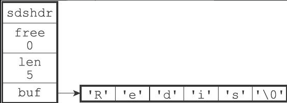

#### SDS与C语言字符串的区别

#####  获取字符串长度常数复杂度

字符串需要遍历

##### 杜绝缓冲区溢出

C语言不记录长度，易造成该错误，比如字符串拼接会默认已有足够空间，而SDS会先检查空间是否满才会执行操作，不满足会分配

##### 减少修改字符串时带来的内存重分配次数

C语言对原字符串增加或者删除字符，都要进行内存重分配，拼接（append）则扩展底层空间大小（否则缓冲区溢出），截断操作（trim）则要释放不使用的（否则内存泄漏）

SDS通过未使用空间，实现两种优化策略

+ 空间预分配，预先分配多余的内存空间

  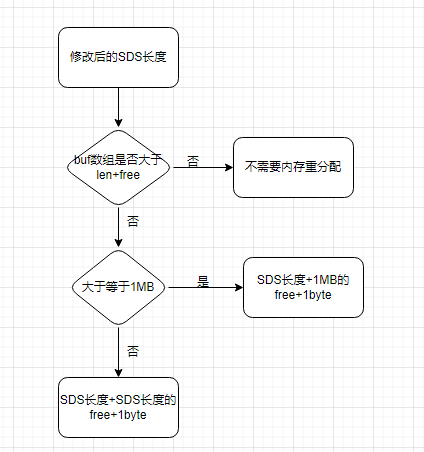

+ 惰性空间释放

  当进行字符串缩短操作时，不进行内存重分配来回收缩短多出来的字节，而是直接改变free属性，待将来使用。同时，有需要时，也有对应的api来释放SDS的未使用空间

##### 二进制安全

C字符串必须符合某种编码比如ASCII，且不能包含空字符，使其只能保存文本不能保存图片，音频，视频等这样的二进制数据

SDS的API是二进制安全的，数据写入什么，被读取就是怎样，SDS使用长度来判定一个字符串的结束

##### 兼容部分C字符串函数

虽然SDS的API二进制安全的，但是依然以空字符串结尾

**总结：**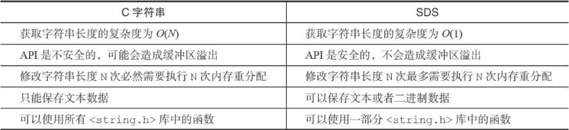

### 链表

链表节点

```c
typedef struct listNode{
    struct listNode * prev;
    struct listNode * next;//双向链
    void * value;//注意是vooid * 不是int
}listNode;
```

链表

```c
typedef struct list{
    //表头节点
    listNode * head;
    listNode * tail;
    unsigned long len;//链表包含的节点数
    //节点值复制函数
    void *(*dup)(void *ptr);
    //节点值释放函数
    void (*free)(void *ptr);
    //节点值对比函数
    int (*match)(void *ptr,void *key);
}list;
```

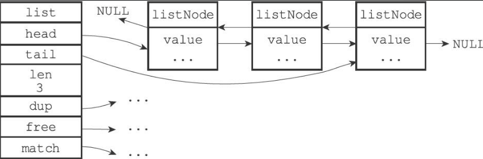

#### 特性

+ 双端，获取某个节点前置后置节点复杂度为O(1)，表头指针与表尾指针也是
+ 无环，表头的pre与表尾的next均指向NULL
+ 链接计时器，获取节点数量复杂度为O(1)
+ 多态，节点使用```void*```指针保存节点值，三个函数也是（为节点设置类型特定函数），因此链表可以保存各种不同类型的值

#### 应用

+ 链表键，尤其是当列表键含有数量较多的元素，或者元素都是比较长的字符串
+ 发布与订阅，慢查询，监视器，保存多个客户端的状态信息，客户端缓冲区

### 字典

#### 实现

##### 哈希表

```c
typedef struct dictht{
    //哈希表数组
    dicEntry **table;//指针数组，每个元素是指向dicEntry结构的指针
    //哈希表大小
    unsigned long size;//table的大小
    //哈希表大小掩码，=size -1
    unsigned long sizemark;
    //哈希表已有节点的数量
    unsigned long used;
}dictht;
```

##### 哈希表节点

``` c
typedef struct dicEntry{
    //键
    void *key;
    //值 既可以是指针，也可以是是uint64_t整数，也可以是int64_t整数
    union{
        void *val;
        uint64_tu64;
        int64_ts64;
    }v;
    //指向下一个哈希表节点，形成链表
    struct dicEntry *next; //将多个哈希值相同的键值对连接在一起，来解决冲突问题
}dicEntry;
```

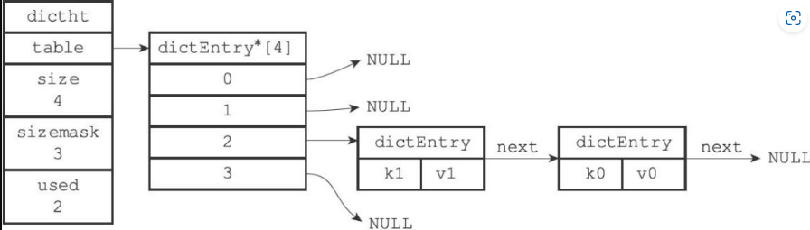

其中k1,k2索引值相同

##### 字典

```c++
typedef struct dict {    
    //类型特定函数    
    dictType *type;    
    //私有数据    
    void *privdata;    
    //哈希表    
    dictht ht[2];    //一般情况使用ht[0]哈希表，ht[1]哈希表只在ht[0]哈希表进行rehash时使用
    // rehash索引    
    in rehashidx;//记录rehash目前的进度，当rehash不在进行时，值为-1    
    /* rehashing not in progress if rehashidx == -1 */
} dict;
```

```c
//dictType 保存一簇用于操作特定类型键值对的函数。为用途不同的字典设置不同的类型特定函数
typedef struct dictType {    
    //计算哈希值的函数    
    unsigned int (*hashFunction)(const void *key);    
    //复制键的函数    
    void *(*keyDup)(void *privdata, const void *key);    
    //复制值的函数    
    void *(*valDup)(void *privdata, const void *obj);    
    //对比键的函数    
    int (*keyCompare)(void *privdata, const void *key1, const void *key2);    
    //销毁键的函数    
    void (*keyDestructor)(void *privdata, void *key);    
    //销毁值的函数    
    void (*valDestructor)(void *privdata, void *obj);
} dictType;
```

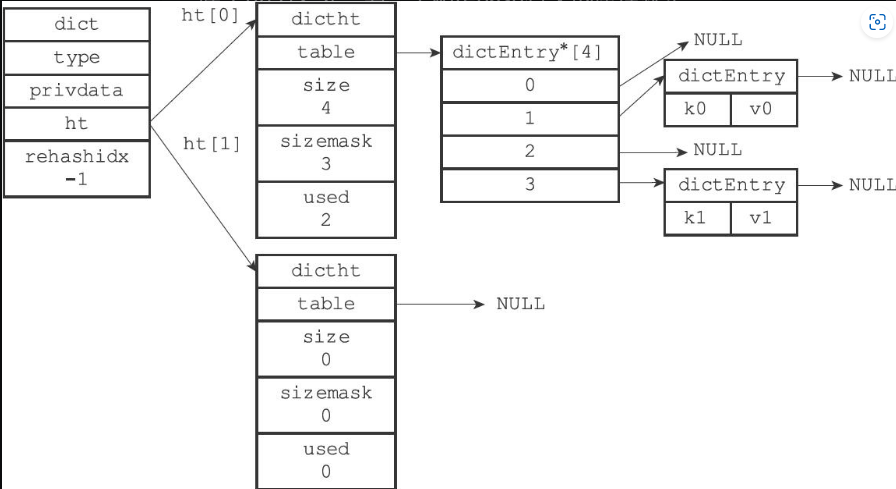

#### 加入键

例子：将一个键值对k0与v0添加到字典里面，

```c
hash = dict->type->hashFunction(k0); //计算键k0的哈希值 使用的是MurmurHash2算法（在数据库与哈希键的时候）
index = hash&dict->ht[0].sizemask //情况不同，ht[x]可以是ht[0]或者ht[1]
//假设最后算出索引值为0  
```

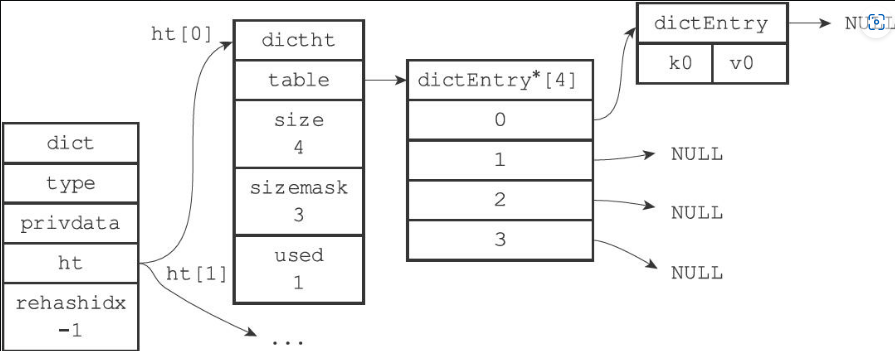

键冲突：则加入对应索引的最后一个链表的next指针

#### rehash---重新散列

##### 背景：

哈希表保存的键值对会逐渐地增多或者减少，为使哈希表的负载因子```load factor =ht[0].used / ht[0].size ```

维持在合理的水平，需要对哈希表进行扩展或者收缩

##### 流程：

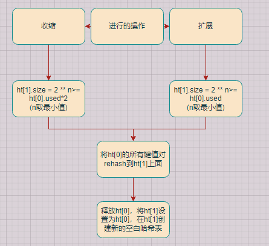

##### 扩展与收缩的时刻

扩展

+ 服务器没有在执行```BGSAVE```命令或者```BGREWRITEAOF```，且哈希表的负载因子大于等于1
+ 服务器目前在执行。。。。。。。。。。。。。。。，。。。。。。。。。。。。5

注：因为执行以上两个命令时，Redis需要创建当前服务器进程的子进程，而为优化子进程的使用效率大多数操作系统采用写时复制技术，因此，服务器提高负载因子，从而避免子进程存在期间进行哈希表扩展操作，避免不必要的内存写入，最大地节约内存

收缩

+ 负载因子小于0.1

##### 渐进式rehash

含义：服务器不是一次性将ht[0]里面键值对全部rehash到ht[1]中，而是分多次，渐进式地

流程：为ht[1]分配空间，字典持有两个哈希表----------->rehash开始时，设rehashdx值为0----------->每次对字典进行增删改查时，还会顺带进行rehash操作，rehash一个成功则rehashdx增一----------->知道全部rehash完毕，rehashdx属性值设为-1

注：第三步会同时操作ht[0]与ht[1]表，如增加会直接走ht[1]中进行，查找会先在ht[0]再在ht[1]上

#### 应用

数据库与哈希键

### 跳跃表

有序数据结构，每个节点中维持多个指向其他节点的指针，复杂度平均O(logN)，最坏O(N)

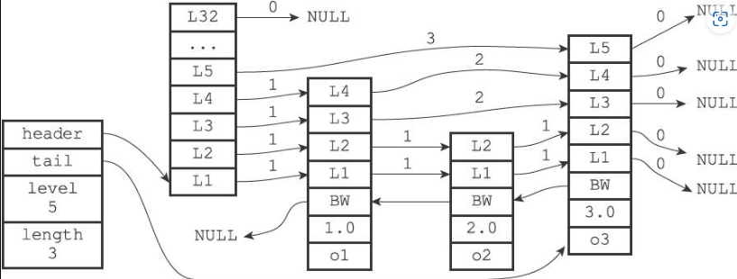

#### 跳跃表节点

```c
typedef struct zskiplistNode {    
    //层    
    struct zskiplistLevel {        
        //前进指针        
        struct zskiplistNode *forward;        
        //跨度        unsigned int span;    
    } level[];    
    //后退指针    
    struct zskiplistNode *backward; //BW指针   
    //分值    
    double score;    //如图中的1.0,2.0,节点按各自所保存的分值从大到小排序
    //成员对象    
    obj *obj;
} zskiplistNode;
//注：表头节点也和其他节点有后面三个属性，只是不会被用到
```

+ 层：通过层来加快访问其他节点的速度，一个节点的层数是1-32之间的随机数
+ 前进指针：每一层都有一个指向表尾方向的指针，迭代程序会首先访问跳跃表的第一个节点，然后从第四层的前进指针移动到表中的第二层，依次类推，知道沿着第四个节点的前进指针移动时，碰到NULL，说明到达表尾，结束遍历
+ 跨度：计算排位，查找某一个节点过程中，沿途所有跨度累计就是排位
+ 后退指针：用于从表尾向表头访问，只能后退到前一个，不能跨，直到遇到NULL
+ 分值和成员：用于排序。优先级：分值>成员对象的字典序  分值为浮点数，不唯一，成员对象为指针，唯一性，指向字符串对象，保存着一个SDS值

#### 跳跃表

```c
typedef struct zskiplist {    
    //表头节点和表尾节点    
    structz skiplistNode *header, *tail;    
    //表中节点的数量   不包含表头节点 
    unsigned long length;    
    //表中层数最大的节点的层数 (不包含表头节点的层数) 
    int level;
} zskiplist;
//注：使查询以上东西复杂度为O(1)
```

#### 应用：

有序集合的底层实现，尤其是该集合元素数量较多或者字符串很长

### 整数集合

#### 实现

```c
typedef struct intset {    
    //编码方式    
    uint32_t encoding;    
    //集合包含的元素数量    
    uint32_t length;    
    //保存元素的数组    
    int8_t contents[];//真正的类型取决于encoding属性的值，有序无重复
} intset;
```

#### 升级

升级的意思是类型转换，从低的升为高的，如```int16_t```改为```int64_t```

##### 升级整数集合并添加新元素流程

+ 根据新元素大小，扩展空间大小
+ 将数组现有元素转换成与新元素相同的类型，并放置正确位置，保持有序性
+ 将新元素添加到底层数组

注：新元素要么最大要么最小，所以不是第一个，就是第二个

##### 升级的好处

+ 提升灵活性，自动升级，我们可以随意添加
+ 节约内存，集合同时保存三种不同类型，又确保升级只会在需要的时候进行

#### 降级

不支持降级，一直保持升级状态

#### 应用：

集合只包含整数值元素，且集合元素数量不多时

### 压缩列表

#### 压缩列表构成

由一系列特殊编码的连续内存块组成的顺序型数据结构

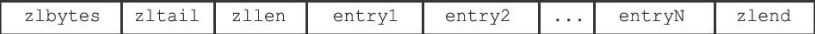

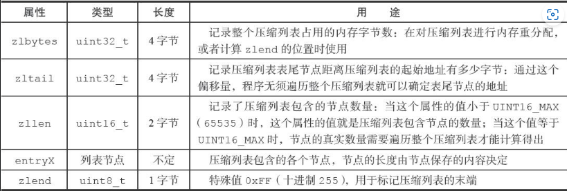

举例：

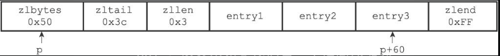

+ 0x50 代表压缩列表的总长80字节
+ 0x3c 指针p加60即到表尾节点
+ 0x3 表示三个节点

#### 压缩列表节点

##### 一个节点可以保存的值：一个字节数组或者一个整数值

字节数组：长度小于等于63；16383（2** 14 -1）；4294967295（2 ** 32 -1）

整数值：4位长，介于0-12之间的无符号整数；一字节，三字节的有符号整数；int16_t，int32_t，int64_t类型整数

##### 组成部分


+ ```previous_entry```：前一个节点的字节长度，如果前一个节点字节小于254字节，那么这个属性的所占空间为1字节，前一节点的长度值就保存在里面；如果大于等于，则所占空间为5字节，属性的第一字节被设置成0xFE(十进制254)，之后五个保存长度； **可以从表尾遍历到表头**

+ ```encoding```：记录节点的content属性所保存数据的类型以及长度。

  字节符编码：前两位代表编码分类，后几位代表长度

  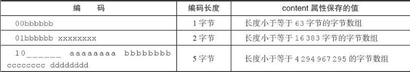

​		整数编码

​				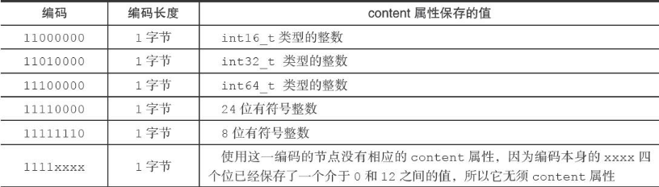 

#### 连锁更新

发生在添加或者删除节点的时候

以更新为例：e1至en长度介于250字节到253字节之间，而加入的new大于254，e1为记录需要扩展空间，从而长度大于等于254，导致e2也扩这样连锁下去

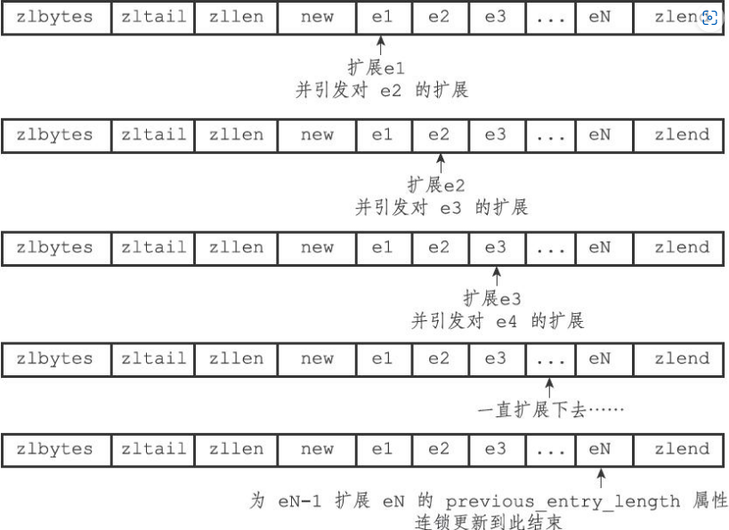

以下删除也是

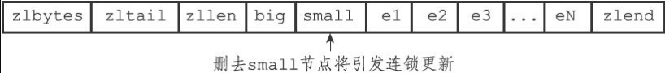

复杂度：O(N ** 2)  每一个节点扩展，都需要对整个压缩列表进行内存重分配，而不只是对应节点

##### 解决：无需解决，因为产生概率小

+ 首先连续几个长度接近254的情况少
+ 其次，只要被更新节点不多，不太影响性能

#### 应用：

列表键和哈希键，

列表键只包含少量的元素，且元素要么是小整数值，要么是长度比较短的字符串，哈希键等同

### 对象

#### 对象的结构

每次当我们在Redis数据库中新创建一个键值对的时候，至少创建两个对象，一个键对象，一个值对象

Redis的每一个对象都由redisObject结构表示，如下

```c++
typedef struct redisObject {    
    //类型    
    unsigned type:4;    
    //编码    
    unsigned encoding:4;    
    //指向底层实现数据结构的指针    
    void *ptr;    
    // ...
} robj;
```

#### 类型

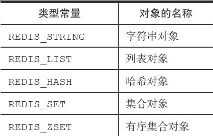

```shell
redis> RPUSH numbers 1 3 5
(integer) 6
redis> TYPE numbers
list
```

#### 编码与底层实现

ptr指针指向对象的底层实现数据结构，而这些数据结构由对象的encoding属性决定，即是这个对象是用来什么数据结构作为对象的底层实现

对象的编码

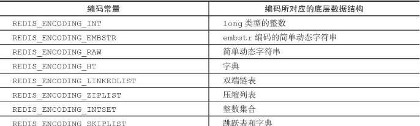

每种类型的对象可以使用的编码

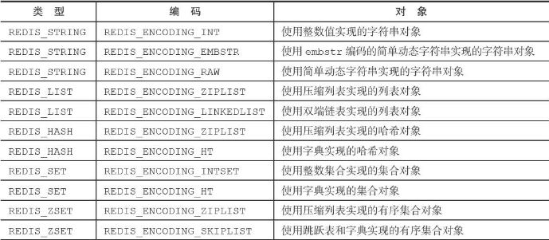

不是为特定类型的对象关联一种固定的编码，而是使其对象可以有多种编码，极大地提升redis的灵活性，可以根据不同使用场景为对象设置不同的编码

如：列表对象元素少，就用压缩列表，元素多就用双端链表

### 字符串


自己认为的一些属性： 记录前面或者后面的属性 头尾 长度